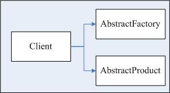
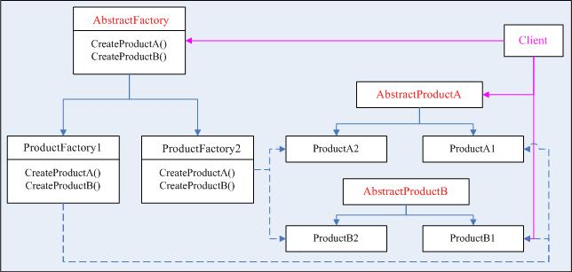
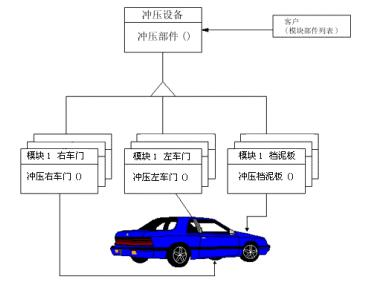
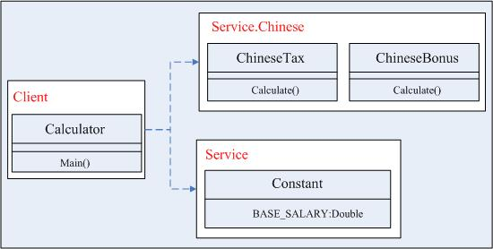
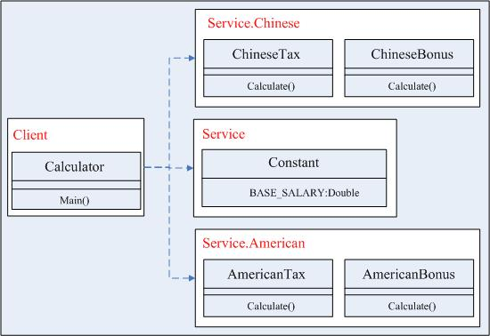
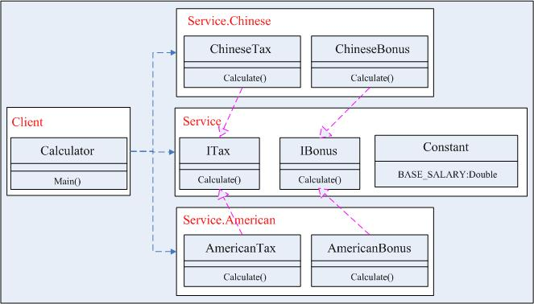
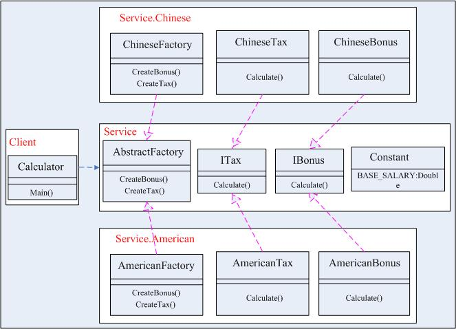

# 抽象工厂模式（Abstract Factory）

- [抽象工厂模式（Abstract Factory）](#抽象工厂模式（abstract-factory）)
    - [概述](#概述)
    - [意图](#意图)
    - [模型图](#模型图)
        - [逻辑模型：](#逻辑模型：)
        - [物理模型：](#物理模型：)
        - [生活中的例子](#生活中的例子)
        - [抽象工厂之新解](#抽象工厂之新解)
            - [虚拟案例](#虚拟案例)
            - [案例分析](#案例分析)
            - [针对中国企业为系统建模](#针对中国企业为系统建模)
            - [针对美国企业为系统建模](#针对美国企业为系统建模)
            - [整合成通用系统](#整合成通用系统)
            - [让移植工作更简单](#让移植工作更简单)
            - [为业务规则增加工厂方法](#为业务规则增加工厂方法)
            - [为系统增加抽象工厂方法](#为系统增加抽象工厂方法)
            - [最后的修正（不是最终方案）](#最后的修正（不是最终方案）)
    - [小结](#小结)
        - [应对“新对象”](#应对“新对象”)
        - [实现要点](#实现要点)
        - [优点](#优点)
        - [缺点](#缺点)
        - [适用性](#适用性)
        - [应用场景](#应用场景)
    - [总结](#总结)


## 概述

在软件系统中，经常面临着“一系列相互依赖的对象”的创建工作；同时由于需求的变化，往往存在着更多系列对象的创建工作。如何应对这种变化？如何绕过常规的对象的创建方法（new），提供一种“封装机制”来避免客户程序和这种“多系列具体对象创建工作”的紧耦合？这就是我们要说的抽象工厂模式。

## 意图

提供一个创建一系列相关或相互依赖对象的接口，而无需指定它们具体的类。

## 模型图

### 逻辑模型：



### 物理模型：



### 生活中的例子

抽象工厂的目的是要提供一个创建一系列相关或相互依赖对象的接口，而不需要指定它们具体的类。这种模式可以汽车制造厂所使用的金属冲压设备中找到。这种冲压设备可以制造汽车车身部件。同样的机械用于冲压不同的车型的右边车门、左边车门、右前挡泥板、左前挡泥板和引擎罩等等。通过使用转轮来改变冲压盘，这个机械产生的具体类可以在三分钟内改变。



### 抽象工厂之新解

#### 虚拟案例

中国企业需要一项简单的财务计算：每月月底，财务人员要计算员工的工资。

员工的工资 = (基本工资 + 奖金 - 个人所得税)。这是一个放之四海皆准的运算法则。

为了简化系统，我们假设员工基本工资总是4000美金。

中国企业奖金和个人所得税的计算规则是:

        奖金 = 基本工资(4000) * 10%

        个人所得税 = (基本工资 + 奖金) * 40%

我们现在要为此构建一个软件系统（代号叫Softo），满足中国企业的需求。

#### 案例分析

奖金(Bonus)、个人所得税(Tax)的计算是Softo系统的业务规则(Service)。

工资的计算(Calculator)则调用业务规则(Service)来计算员工的实际工资。

工资的计算作为业务规则的前端(或者客户端Client)将提供给最终使用该系统的用户(财务人员)使用。

#### 针对中国企业为系统建模

根据上面的分析，为Softo系统建模如下：

 

则业务规则Service类的代码如下：
```cs
using System;

namespace ChineseSalary
{
    /// <summary>
    /// 公用的常量
    /// </summary>
    public class Constant
    {
        public static double BASE_SALARY = 4000;
    }
}
using System;

namespace ChineseSalary
{
    /// <summary>
    /// 计算中国个人奖金
    /// </summary>
    public class ChineseBonus
    {
        public double Calculate()
        {
            return Constant.BASE_SALARY * 0.1;
        }
    }
}

```
客户端的调用代码：
```cs
using System;

namespace ChineseSalary
{    
    /// <summary>
    /// 计算中国个人所得税
    /// </summary>
    public class ChineseTax
    {
        public double Calculate()
        {
            return (Constant.BASE_SALARY + (Constant.BASE_SALARY * 0.1)) * 0.4;
        }
    }
}

```
运行程序，输入的结果如下：

    Chinese Salary is：2640

#### 针对美国企业为系统建模

为了拓展国际市场，我们要把该系统移植给美国公司使用。

美国企业的工资计算同样是: 员工的工资 = 基本工资 + 奖金 - 个人所得税。

但是他们的奖金和个人所得税的计算规则不同于中国企业:

美国企业奖金和个人所得税的计算规则是:

        奖金 = 基本工资 * 15 %

        个人所得税 = (基本工资 * 5% + 奖金 * 25%)  

根据前面为中国企业建模经验，我们仅仅将ChineseTax、ChineseBonus修改为AmericanTax、AmericanBonus。 修改后的模型如下：


则业务规则Service类的代码如下：
```cs
using System;

namespace AmericanSalary
{
    /// <summary>
    /// 公用的常量
    /// </summary>
    public class Constant
    {
        public static double BASE_SALARY = 4000;
    }
}


using System;

namespace AmericanSalary
{
    /// <summary>
    /// 计算美国个人奖金
    /// </summary>
    public class AmericanBonus
    {
        public double Calculate()
        {
            return Constant.BASE_SALARY * 0.1;
        }
    }
}

using System;

namespace AmericanSalary
{    
    /// <summary>
    /// 计算美国个人所得税
    /// </summary>
    public class AmericanTax
    {
        public double Calculate()
        {
            return (Constant.BASE_SALARY + (Constant.BASE_SALARY * 0.1)) * 0.4;
        }
    }
}
```

客户端的调用代码：

```cs
using System;

namespace AmericanSalary
{
    /// <summary>
    /// 客户端程序调用
    /// </summary>
    public class Calculator 
    {
        public static void Main(string[] args) 
        {
            AmericanBonus bonus = new AmericanBonus();
            double bonusValue  = bonus.Calculate();
    
            AmericanTax tax = new AmericanTax();
            double taxValue = tax.Calculate();
    
            double salary = 4000 + bonusValue - taxValue; 

            Console.WriteLine("American Salary is：" + salary);
            Console.ReadLine();
        }
    }
}

```

运行程序，输入的结果如下：

    American Salary is：2640

#### 整合成通用系统

让我们回顾一下该系统的发展历程：

最初，我们只考虑将Softo系统运行于中国企业。但随着MaxDO公司业务向海外拓展， MaxDO需要将该系统移植给美国使用。

移植时，MaxDO不得不抛弃中国企业的业务规则类ChineseTax和ChineseBonus， 然后为美国企业新建两个业务规则类: AmericanTax,AmericanBonus。最后修改了业务规则调用Calculator类。

结果我们发现：每当Softo系统移植的时候，就抛弃原来的类。现在，如果中国联想集团要购买该系统，我们不得不再次抛弃AmericanTax,AmericanBonus，修改回原来的业务规则。

一个可以立即想到的做法就是在系统中保留所有业务规则模型，即保留中国和美国企业工资运算规则。



通过保留中国企业和美国企业的业务规则模型，如果该系统在美国企业和中国企业之间切换时，我们仅仅需要修改Caculator类即可。

#### 让移植工作更简单

前面系统的整合问题在于：当系统在客户在美国和中国企业间切换时仍然需要修改Caculator代码。

一个维护性良好的系统应该遵循“开闭原则”。即：封闭对原来代码的修改，开放对原来代码的扩展（如类的继承，接口的实现）

我们发现不论是中国企业还是美国企业，他们的业务运规则都采用同样的计算接口。 于是很自然地想到建立两个业务接口类Tax，Bonus，然后让AmericanTax、AmericanBonus和ChineseTax、ChineseBonus分别实现这两个接口， 据此修正后的模型如下：

 

此时客户端代码如下：

```cs

using System;

namespace InterfaceSalary
{
    /// <summary>
    /// 客户端程序调用
    /// </summary>
    public class Calculator 
    {
        public static void Main(string[] args) 
        {
            Bonus bonus = new ChineseBonus();
            double bonusValue  = bonus.Calculate();
    
            Tax tax = new ChineseTax();
            double taxValue = tax.Calculate();
    
            double salary = 4000 + bonusValue - taxValue; 

            Console.WriteLine("Chinaese Salary is：" + salary);
            Console.ReadLine();
        }
    }
}

```

#### 为业务规则增加工厂方法

然而，上面增加的接口几乎没有解决任何问题，因为当系统的客户在美国和中国企业间切换时Caculator代码仍然需要修改。

只不过修改少了两处，但是仍然需要修改ChineseBonus,ChineseTax部分。致命的问题是：我们需要将这个移植工作转包给一个叫Hippo的软件公司。 由于版权问题，我们并未提供Softo系统的源码给Hippo公司，因此Hippo公司根本无法修改Calculator，导致实际上移植工作无法进行。

为此，我们考虑增加一个工具类(命名为Factory)，代码如下：

```cs
using System;

namespace FactorySalary
{
    /// <summary>
    /// Factory类
    /// </summary>
    public class Factory
    {
        public Tax CreateTax()
        {
            return new ChineseTax();
        }

        public Bonus CreateBonus()
        {
            return new ChineseBonus();
        }
    }
}

```
修改后的客户端代码：

```cs

using System;

namespace FactorySalary
{
    /// <summary>
    /// 客户端程序调用
    /// </summary>
    public class Calculator 
    {
        public static void Main(string[] args) 
        {
            Bonus bonus = new Factory().CreateBonus();
            double bonusValue  = bonus.Calculate();
    
            Tax tax = new Factory().CreateTax();
            double taxValue = tax.Calculate();
    
            double salary = 4000 + bonusValue - taxValue; 

            Console.WriteLine("Chinaese Salary is：" + salary);
            Console.ReadLine();
        }
    }
}
```

不错，我们解决了一个大问题，设想一下：当该系统从中国企业移植到美国企业时，我们现在需要做什么？

答案是: 对于Caculator类我们什么也不用做。我们需要做的是修改Factory类，修改结果如下：

```cs
using System;

namespace FactorySalary
{
    /// <summary>
    /// Factory类
    /// </summary>
    public class Factory
    {
        public Tax CreateTax()
        {
            return new AmericanTax();
        }

        public Bonus CreateBonus()
        {
            return new AmericanBonus();
        }
    }
}
```

#### 为系统增加抽象工厂方法

很显然，前面的解决方案带来了一个副作用：就是系统不但增加了新的类Factory，而且当系统移植时，移植工作仅仅是转移到Factory类上，工作量并没有任何缩减，而且还是要修改系统的源码。 从Factory类在系统移植时修改的内容我们可以看出: 实际上它是专属于美国企业或者中国企业的。名称上应该叫AmericanFactory,ChineseFactory更合适.

解决方案是增加一个抽象工厂类AbstractFactory，增加一个静态方法，该方法根据一个配置文件(App.config或者Web.config) 一个项(比如factoryName)动态地判断应该实例化哪个工厂类，这样，我们就把移植工作转移到了对配置文件的修改。修改后的模型和代码：

 

抽象工厂类的代码如下：

```cs
using System;
using System.Reflection;
 
namespace AbstractFactory
{
     /// <summary>
     /// AbstractFactory类
     /// </summary>
     public abstract class AbstractFactory
    {
        public static AbstractFactory GetInstance()
        {
            string factoryName = Constant.STR_FACTORYNAME.ToString();

            AbstractFactory instance;

            if(factoryName == "ChineseFactory")
                instance = new ChineseFactory();
            else if(factoryName == "AmericanFactory")
                instance = new AmericanFactory();
            else
                instance = null;

            return instance;
        }

        public abstract Tax CreateTax();

        public abstract Bonus CreateBonus();
    }
}
```

配置文件：
```xml
<?xml version="1.0" encoding="utf-8" ?>
<configuration>
    <appSettings>
        <add key="factoryName" value="AmericanFactory"></add>
    </appSettings>
</configuration>
```

采用上面的解决方案，当系统在美国企业和中国企业之间切换时，我们需要做什么移植工作？


答案是: 我们仅仅需要修改配置文件，将factoryName的值改为American。

修改配置文件的工作很简单，只要写一篇幅配置文档说明书提供给移植该系统的团队(比如Hippo公司) 就可以方便地切换使该系统运行在美国或中国企业。

#### 最后的修正（不是最终方案）

前面的解决方案几乎很完美，但是还有一点瑕疵，瑕疵虽小，但可能是致命的。

考虑一下，现在日本NEC公司决定购买该系统，NEC公司的工资的运算规则遵守的是日本的法律。如果采用上面的系统构架，这个移植我们要做哪些工作呢?

    1. 增加新的业务规则类JapaneseTax,JapaneseBonus分别实现Tax和Bonus接口。
    2. 修改AbstractFactory的getInstance方法，增加else if(factoryName.equals("Japanese")){....

注意: 系统中增加业务规则类不是模式所能解决的，无论采用什么设计模式，JapaneseTax,JapaneseBonus总是少不了的。（即增加了新系列产品）

**我们真正不能接受的是**：我们仍然修要修改系统中原来的类(AbstractFactory)。前面提到过该系统的移植工作，我们可能转包给一个叫Hippo的软件公司。 为了维护版权，未将该系统的源码提供给Hippo公司，那么Hippo公司根本无法修改AbstractFactory，所以系统移植其实无从谈起，或者说系统移植总要开发人员亲自参与。

解决方案是将抽象工厂类中的条件判断语句，用.NET中发射机制代替，修改如下：

```cs
using System;
using System.Reflection;

namespace AbstractFactory
{
    /// <summary>
    /// AbstractFactory类
    /// </summary>
    public abstract class AbstractFactory
    {
        public static AbstractFactory GetInstance()
        {
            string factoryName = Constant.STR_FACTORYNAME.ToString();

            AbstractFactory instance;

            if(factoryName != "")
                instance = (AbstractFactory)Assembly.Load(factoryName).CreateInstance(factoryName);
            else
                instance = null;

            return instance;
        }

        public abstract Tax CreateTax();

        public abstract Bonus CreateBonus();
    }
}
```

这样，在我们编写的代码中就不会出现Chinese，American，Japanese等这样的字眼了。

## 小结

最后那幅图是最终版的系统模型图。我们发现作为客户端角色的Calculator仅仅依赖抽象类， 它不必去理解中国和美国企业具体的业务规则如何实现，Calculator面对的仅仅是业务规则接口Tax和Bonus。

Softo系统的实际开发的分工可能是一个团队专门做业务规则，另一个团队专门做前端的业务规则组装。 抽象工厂模式有助于这样的团队的分工: 两个团队通讯的约定是业务接口，由抽象工厂作为纽带粘合业务规则和前段调用，大大降低了模块间的耦合性，提高了团队开发效率。

完完全全地理解抽象工厂模式的意义非常重大，可以说对它的理解是你对OOP理解上升到一个新的里程碑的重要标志。 学会了用抽象工厂模式编写框架类，你将理解OOP的精华:面向接口编程.。

### 应对“新对象”

抽象工厂模式主要在于应对“新系列”的需求变化。其缺点在于难于应付“新对象”的需求变动。如果在开发中出现了新对象，该如何去解决呢？这个问题并没有一个好的答案，下面我们看一下李建忠老师的回答：

“GOF《设计模式》中提出过一种解决方法，即给创建对象的操作增加参数，但这种做法并不能令人满意。事实上，对于新系列加新对象，就我所知，目前还没有完美的做法，只有一些演化的思路，这种变化实在是太剧烈了，因为系统对于新的对象是完全陌生的。”

### 实现要点

- 抽象工厂将产品对象的创建延迟到它的具体工厂的子类。

- 如果没有应对“多系列对象创建”的需求变化，则没有必要使用抽象工厂模式，这时候使用简单的静态工厂完全可以。

- 系列对象指的是这些对象之间有相互依赖、或作用的关系，例如游戏开发场景中的“道路”与“房屋”的依赖，“道路”与“地道”的依赖。

- 抽象工厂模式经常和工厂方法模式共同组合来应对“对象创建”的需求变化。

- 通常在运行时刻创建一个具体工厂类的实例，这一具体工厂的创建具有特定实现的产品对象，为创建不同的产品对象，客户应使用不同的具体工厂。

- 把工厂作为单件，一个应用中一般每个产品系列只需一个具体工厂的实例，因此，工厂通常最好实现为一个单件模式。

- 创建产品，抽象工厂仅声明一个创建产品的接口，真正创建产品是由具体产品类创建的，最通常的一个办法是为每一个产品定义一个工厂方法，一个具体的工厂将为每个产品重定义该工厂方法以指定产品，虽然这样的实现很简单，但它确要求每个产品系列都要有一个新的具体工厂子类，即使这些产品系列的差别很小。

### 优点

- 分离了具体的类。抽象工厂模式帮助你控制一个应用创建的对象的类，因为一个工厂封装创建产品对象的责任和过程。它将客户和类的实现分离，客户通过他们的抽象接口操纵实例，产品的类名也在具体工厂的实现中被分离，它们不出现在客户代码中。

- 它使得易于交换产品系列。一个具体工厂类在一个应用中仅出现一次——即在它初始化的时候。这使得改变一个应用的具体工厂变得很容易。它只需改变具体的工厂即可使用不同的产品配置，这是因为一个抽象工厂创建了一个完整的产品系列，所以整个产品系列会立刻改变。

- 它有利于产品的一致性。当一个系列的产品对象被设计成一起工作时，一个应用一次只能使用同一个系列中的对象，这一点很重要，而抽象工厂很容易实现这一点。

### 缺点

- 难以支持新种类的产品。难以扩展抽象工厂以生产新种类的产品。这是因为抽象工厂几口确定了可以被创建的产品集合，支持新种类的产品就需要扩展该工厂接口，这将涉及抽象工厂类及其所有子类的改变。

### 适用性

在以下情况下应当考虑使用抽象工厂模式：

- 一个系统不应当依赖于产品类实例如何被创建、组合和表达的细节，这对于所有形态的工厂模式都是重要的。

- 这个系统有多于一个的产品族，而系统只消费其中某一产品族。

- 同属于同一个产品族的产品是在一起使用的，这一约束必须在系统的设计中体现出来。

- 系统提供一个产品类的库，所有的产品以同样的接口出现，从而使客户端不依赖于实现。

### 应用场景

- 支持多种观感标准的用户界面工具箱（Kit）。

- 游戏开发中的多风格系列场景，比如道路，房屋，管道等。

- ……

## 总结

总之，抽象工厂模式提供了一个创建一系列相关或相互依赖对象的接口，运用抽象工厂模式的关键点在于应对“多系列对象创建”的需求变化。一句话，学会了抽象工厂模式，你将理解OOP的精华：面向接口编程。

---

源程序下载：[AbstractFactory.rar](http://files.cnblogs.com/Terrylee/AbstractFactory.rar)

参考文献

http://blog.dreambrook.com

《Java与模式》

《设计模式》

《Design  Patterns  Explained》
