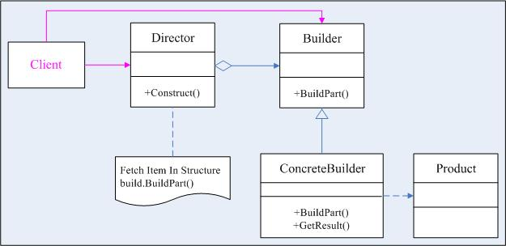
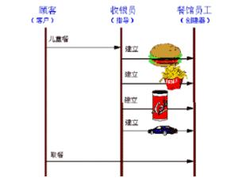
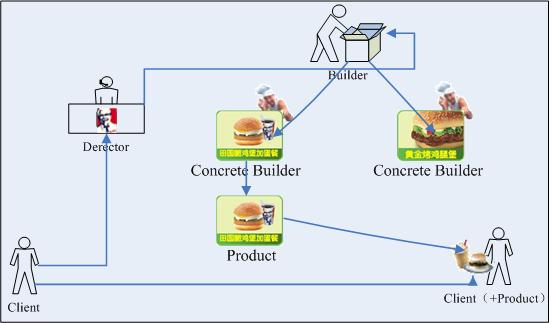
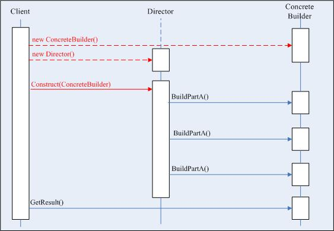
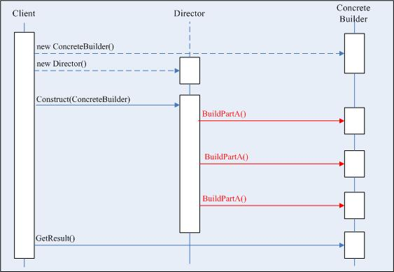

# 建造者模式（Builder Pattern）
- [建造者模式（Builder Pattern）](#建造者模式（builder-pattern）)
    - [概述](#概述)
    - [意图](#意图)
    - [模型图](#模型图)
    - [生活中的例子](#生活中的例子)
    - [实现过程图解](#实现过程图解)
    - [另外一个例子](#另外一个例子)
    - [建造者模式的几种演化](#建造者模式的几种演化)
        - [省略抽象建造者角色](#省略抽象建造者角色)
        - [省略指导者角色](#省略指导者角色)
        - [合并建造者角色和产品角色](#合并建造者角色和产品角色)
    - [实现要点](#实现要点)
    - [效果](#效果)
    - [适用性](#适用性)
    - [应用场景](#应用场景)
    - [总结](#总结)


## 概述

在软件系统中，有时候面临着“一个复杂对象”的创建工作，其通常由各个部分的子对象用一定的算法构成；由于需求的变化，这个复杂对象的各个部分经常面临着剧烈的变化，但是将它们组合在一起的算法确相对稳定。如何应对这种变化？如何提供一种“封装机制”来隔离出“复杂对象的各个部分”的变化，从而保持系统中的“稳定构建算法”不随着需求改变而改变？这就是要说的建造者模式。

本文通过现实生活中的买KFC的例子，用图解的方式来诠释建造者模式。

## 意图

将一个复杂的构建与其表示相分离，使得同样的构建过程可以创建不同的表示。

## 模型图



## 生活中的例子

生成器模式将复杂对象的构建与对象的表现分离开来，这样使得同样的构建过程可以创建出不同的表现。这种模式用于快餐店制作儿童餐。典型的儿童餐包括一个主食，一个辅食，一杯饮料和一个玩具（例如汉堡. 炸鸡. 可乐和玩具车）。这些在不同的儿童餐中可以是不同的，但是组合成儿童餐的过程是相同的。无论顾客点的是汉堡，三名治还是鸡肉，过程都是一样的。柜台的员工直接把主食，辅食和玩具放在一起。这些是放在一个袋子中的。饮料被倒入杯中，放在袋子外边。这些过程在相互竞争的餐馆中是同样的。



## 实现过程图解

在这里我们还是以去KFC店买套餐为例子，示意图如下：



客户端：顾客。想去买一套套餐（这里面包括汉堡，可乐，薯条），可以有1号和2号两种套餐供顾客选择。

指导者角色：收银员。知道顾客想要买什么样的套餐，并告诉餐馆员工去准备套餐。

建造者角色：餐馆员工。按照收银员的要求去准备具体的套餐，分别放入汉堡，可乐，薯条等。

产品角色：最后的套餐，所有的东西放在同一个盘子里面。

下面开始我们的买套餐过程。

1．客户创建Derector对象，并用它所想要的Builder对象进行配置。顾客进入KFC店要买套餐，先找到一个收银员，相当于创建了一个指导者对象。这位收银员给出两种套餐供顾客选择：1普通套餐，2黄金套餐。完成的工作如时序图中红色部分所示。



程序实现：

```cs
using System;
using System.Configuration;
using System.Reflection;

namespace KFC
{
    /// <summary>
    /// Client 类
    /// </summary>
    public class Client
    {
        public static void Main(string[] args)
        {
            FoodManager foodmanager = new FoodManager();

            Builder instance;

            Console.WriteLine("Please Enter Food No:");

            string No = Console.ReadLine();

            string foodType = ConfigurationSettings.AppSettings["No"+No];

            instance = (Builder)Assembly.Load("KFC").CreateInstance("KFC." + foodType);

            foodmanager.Construct(instance);
        }
    }
}

```

产品（套餐）类：

```cs
using System;
using System.Collections;

namespace KFC
{
    /// <summary>
    /// Food类，即产品类
    /// </summary>
    public class Food
    {
        Hashtable food = new Hashtable();
        
        /// <summary>
        /// 添加食品
        /// </summary>
        /// <param name="strName">食品名称</param>
        /// <param name="Price">价格</param>
        public void Add(string strName,string Price)
        {
            food.Add(strName,Price);
        }
        
        /// <summary>
        /// 显示食品清单
        /// </summary>
        public void Show()
        {
            IDictionaryEnumerator myEnumerator  = food.GetEnumerator();
            Console.WriteLine("Food List:");
            Console.WriteLine("------------------------------");
            string strfoodlist = "";
            while(myEnumerator.MoveNext())
            {
                strfoodlist = strfoodlist + "\n\n" + myEnumerator.Key.ToString();
                strfoodlist = strfoodlist + ":\t" +myEnumerator.Value.ToString();
            }
            Console.WriteLine(strfoodlist);
            Console.WriteLine("\n------------------------------");
        }
    }
}
```

2．指导者通知建造器。收银员（指导者）告知餐馆员工准备套餐。这里我们准备套餐的顺序是：放入汉堡，可乐倒入杯中，薯条放入盒中，并把这些东西都放在盘子上。这个过程对于普通套餐和黄金套餐来说都是一样的，不同的是它们的汉堡，可乐，薯条价格不同而已。如时序图红色部分所示：



程序实现：

```cs
using System;

namespace KFC
{
    /// <summary>
    /// FoodManager类，即指导者
    /// </summary>
    public class FoodManager
    {
        public void Construct(Builder builder)
        {
            builder.BuildHamb();

            builder.BuildCoke();

            builder.BuildChip();
        }    
    }
}
```

3．建造者处理指导者的要求，并将部件添加到产品中。餐馆员工（建造者）按照收银员要求的把对应的汉堡，可乐，薯条放入盘子中。这部分是建造者模式里面富于变化的部分，因为顾客选择的套餐不同，套餐的组装过程也不同，这步完成产品对象的创建工作。

程序实现：

```cs
using System;

namespace KFC
{
    /// <summary>
    /// Builder类，即抽象建造者类，构造套餐
    /// </summary>
    public abstract class Builder
    {    
        /// <summary>
        /// 添加汉堡
        /// </summary>
        public abstract void BuildHamb();
        
        /// <summary>
        /// 添加可乐
        /// </summary>
        public abstract void BuildCoke();
        
        /// <summary>
        /// 添加薯条
        /// </summary>
        public abstract void BuildChip();
        
        /// <summary>
        /// 返回结果
        /// </summary>
        /// <returns>食品对象</returns>
        public abstract Food GetFood();
    }
}

using System;

namespace KFC
{
    /// <summary>
    /// NormalBuilder类，具体构造者，普通套餐
    /// </summary>
    public class NormalBuilder:Builder
    {
        private Food NormalFood = new Food();

        public override void BuildHamb()
        {
            NormalFood.Add("NormalHamb","￥10.50");
        }
        
        public override void BuildCoke()
        {
            NormalFood.Add("CokeCole","￥4.50");
        }

        public override void BuildChip()
        {
            NormalFood.Add("FireChips","￥2.00");
        }

        public override Food GetFood()
        {
            return NormalFood;
        }

    }
}

using System;

namespace KFC
{
    /// <summary>
    /// GoldBuilder类，具体构造者，黄金套餐
    /// </summary>
    public class GoldBuilder:Builder
    {
        private Food GoldFood = new Food();

        public override void BuildHamb()
        {
            GoldFood.Add("GoldHamb","￥13.50");
        }
        
        public override void BuildCoke()
        {
            GoldFood.Add("CokeCole","￥4.50");
        }

        public override void BuildChip()
        {
            GoldFood.Add("FireChips","￥3.50");
        }

        public override Food GetFood()
        {
            return GoldFood;
        }

    }
}
```

4．客户从建造者检索产品。从餐馆员工准备好套餐后，顾客再从餐馆员工那儿拿回套餐。这步客户程序要做的仅仅是取回已经生成的产品对象，如时序图中红色部分所示。


完整的客户程序：

```cs
using System;
using System.Configuration;
using System.Reflection;

namespace KFC
{
    /// <summary>
    /// Client 类
    /// </summary>
    public class Client
    {
        public static void Main(string[] args)
        {
            FoodManager foodmanager = new FoodManager();

            Builder instance;

            Console.WriteLine("Please Enter Food No:");

            string No = Console.ReadLine();

            string foodType = ConfigurationSettings.AppSettings["No"+No];

            instance = (Builder)Assembly.Load("KFC").CreateInstance("KFC." + foodType);

            foodmanager.Construct(instance);

            Food food = instance.GetFood();
            food.Show();

            Console.ReadLine();
        }
    }
}
```

通过分析不难看出，在这个例子中，在准备套餐的过程是稳定的，即按照一定的步骤去做，而套餐的组成部分则是变化的，有可能是普通套餐或黄金套餐等。这个变化就是建造者模式中的“变化点“，就是我们要封装的部分。

## 另外一个例子

在这里我们再给出另外一个关于建造房子的例子。客户程序通过调用指导者 (CDirector class)的BuildHouse()方法来创建一个房子。该方法有一个布尔型的参数blnBackyard，当blnBackyard为假时指导者将创建一个Apartment（Concrete Builder），当它为真时将创建一个Single Family Home（Concrete Builder）。这两种房子都实现了接口Ihouse。

程序实现：

```cs
//关于建造房屋的例子
using System;
using System.Collections;

/// <summary>
/// 抽象建造者
/// </summary>
public interface IHouse
{
    bool GetBackyard();
    long NoOfRooms();
    string  Description();
}

/// <summary>
/// 具体建造者
/// </summary>
public class CApt:IHouse
{
    private bool mblnBackyard;
    private Hashtable Rooms;
    public CApt()
    {
        CRoom room;    
        Rooms = new Hashtable();
        room = new CRoom();
        room.RoomName = "Master Bedroom";
        Rooms.Add ("room1",room);

        room = new CRoom();
        room.RoomName = "Second Bedroom";
        Rooms.Add ("room2",room);

        room = new CRoom();
        room.RoomName = "Living Room";
        Rooms.Add ("room3",room);
        
        mblnBackyard = false;
    }

    public bool GetBackyard()
    {
        return mblnBackyard;
    }
    public long NoOfRooms()
    {
        return Rooms.Count; 
    }
    public string  Description()
    {
        IDictionaryEnumerator myEnumerator  = Rooms.GetEnumerator();
        string strDescription;
        strDescription = "This is an Apartment with " + Rooms.Count + " Rooms \n";
        strDescription = strDescription + "This Apartment doesn't have a backyard \n";                        
        while (myEnumerator.MoveNext())
        {
            strDescription = strDescription + "\n" + myEnumerator.Key + "\t" + ((CRoom)myEnumerator.Value).RoomName;
        }
        return strDescription;
    }
}

/// <summary>
/// 具体建造者
/// </summary>
public class CSFH:IHouse
{
    private bool mblnBackyard;
    private Hashtable Rooms;
    public CSFH()
    {
        CRoom room;
        Rooms = new Hashtable();

        room = new CRoom();
        room.RoomName = "Master Bedroom";
        Rooms.Add ("room1",room);

        room = new CRoom();
        room.RoomName = "Second Bedroom";
        Rooms.Add ("room2",room);

        room = new CRoom();
        room.RoomName = "Third Room";
        Rooms.Add ("room3",room);
        
        room = new CRoom();
        room.RoomName = "Living Room";
        Rooms.Add ("room4",room);

        room = new CRoom();
        room.RoomName = "Guest Room";
        Rooms.Add ("room5",room);

        mblnBackyard = true;
 
    }

    public bool GetBackyard()
    {
        return mblnBackyard;
    }
    public long NoOfRooms()
    {
        return Rooms.Count;
    }
    public string  Description()
    {
        IDictionaryEnumerator myEnumerator  = Rooms.GetEnumerator();
        string strDescription;
        strDescription = "This is an Single Family Home with " + Rooms.Count + " Rooms \n";
        strDescription = strDescription + "This house has a backyard \n"; 
        while (myEnumerator.MoveNext())
        {
            strDescription = strDescription + "\n" + myEnumerator.Key + "\t" + ((CRoom)myEnumerator.Value).RoomName; 
        }      
        return strDescription;
    }
}

public interface IRoom
{
    string RoomName{get;set;}
}

public class CRoom:IRoom
{
    private string mstrRoomName;
    public string RoomName
    {
        get
        {
            return mstrRoomName;
        }
        set 
        {
            mstrRoomName = value;
        }
    }
}

/// <summary>
/// 指导者
/// </summary>
public class CDirector
{
    public IHouse BuildHouse(bool blnBackyard)
    {
        if (blnBackyard)
        {
            return new CSFH();
        }
        else
        {
            return new CApt(); 
        }
    }
}

/// <summary>
/// 客户程序
/// </summary>
public class Client
{
    static void Main(string[] args) 
    {
        CDirector objDirector = new CDirector();
        IHouse objHouse;

        string Input = Console.ReadLine();
        objHouse = objDirector.BuildHouse(bool.Parse(Input));
    
        Console.WriteLine(objHouse.Description());
        Console.ReadLine();
    }
}
```

## 建造者模式的几种演化

### 省略抽象建造者角色

系统中只需要一个具体建造者，省略掉抽象建造者，结构图如下：


指导者代码如下：

```cs
class Director
{
  private ConcreteBuilder builder;

  public void Construct()
   {
    builder.BuildPartA();
    builder.BuildPartB();
  }
}
```

### 省略指导者角色

抽象建造者角色已经被省略掉，还可以省略掉指导者角色。让Builder角色自己扮演指导者与建造者双重角色。结构图如下：


建造者角色代码如下：

```cs
public class Builder
 {
  private Product product = new Product();

  public void BuildPartA()
   { 
    //
  }

  public void BuildPartB()
   {
    //
  }

  public Product GetResult()
   {
    return product;
  }

  public void Construct()
   {
    BuildPartA();
    BuildPartB();
  }
}
```

客户程序：

```cs
public class Client
 {
  private static Builder builder;

  public static void Main()
   {
    builder = new Builder();
    builder.Construct();
    Product product = builder.GetResult();
  }
}
```

### 合并建造者角色和产品角色

建造模式失去抽象建造者角色和指导者角色后，可以进一步退化，从而失去具体建造者角色，此时具体建造者角色和产品角色合并，从而使得产品自己就是自己的建造者。这样做混淆了对象的建造者和对象本身，但是有时候一个产品对象有着固定的几个零件，而且永远只有这几个零件，此时将产品类和建造类合并，可以使系统简单易读。结构图如下：


## 实现要点
1. 建造者模式主要用于“分步骤构建一个复杂的对象”，在这其中“分步骤”是一个稳定的算法，而复杂对象的各个部分则经常变化。
2. 产品不需要抽象类，特别是由于创建对象的算法复杂而导致使用此模式的情况下或者此模式应用于产品的生成过程，其最终结果可能差异很大，不大可能提炼出一个抽象产品类。
3. 创建者中的创建子部件的接口方法不是抽象方法而是空方法，不进行任何操作，具体的创建者只需要覆盖需要的方法就可以，但是这也不是绝对的，特别是类似文本转换这种情况下，缺省的方法将输入原封不动的输出是合理的缺省操作。
4. 前面我们说过的抽象工厂模式（Abtract Factory）解决“系列对象”的需求变化，Builder模式解决“对象部分”的需求变化，建造者模式常和组合模式（Composite Pattern）结合使用。

## 效果

1. 建造者模式的使用使得产品的内部表象可以独立的变化。使用建造者模式可以使客户端不必知道产品内部组成的细节。
2. 每一个Builder都相对独立，而与其它的Builder无关。
3. 可使对构造过程更加精细控制。
4. 将构建代码和表示代码分开。
5. 建造者模式的缺点在于难于应付“分步骤构建算法”的需求变动。

## 适用性

以下情况应当使用建造者模式：

1. 需要生成的产品对象有复杂的内部结构。
2. 需要生成的产品对象的属性相互依赖，建造者模式可以强迫生成顺序。
3.  在对象创建过程中会使用到系统中的一些其它对象，这些对象在产品对象的创建过程中不易得到。

## 应用场景

1. RTF文档交换格式阅读器。
2. .NET环境下的字符串处理StringBuilder，这是一种简化了的建造者模式。
3. ……

## 总结

建造者模式的实质是解耦组装过程和创建具体部件，使得我们不用去关心每个部件是如何组装的。

---

源程序下载：[BuilderPattern.rar](http://files.cnblogs.com/Terrylee/BuilderPattern.rar)

参考资料：

《Java与设计模式》阎宏 著

《设计模式（中文版）》

《DesignPatternsExplained》
